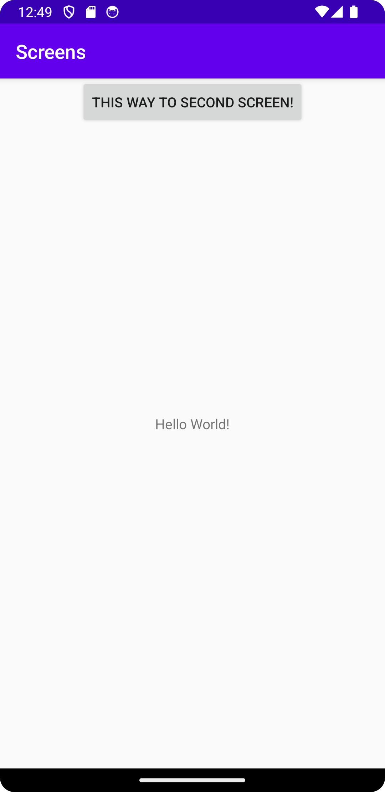
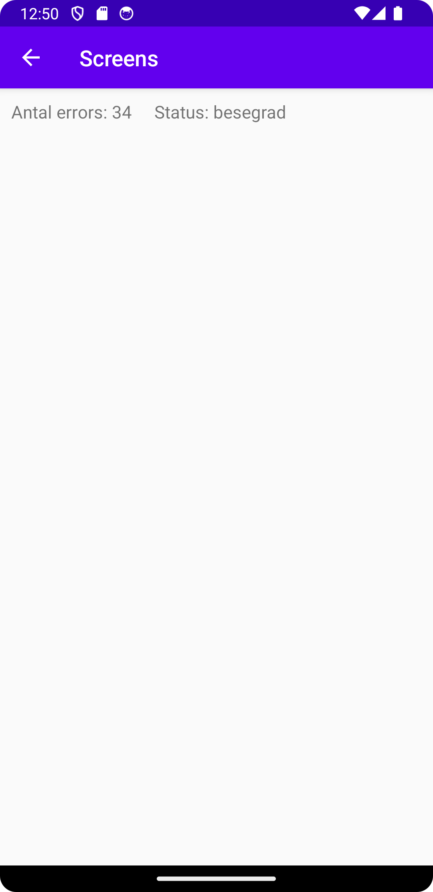

# Rapport

Jag har skapat en second activity med main activity som parent. Jag använder intents för att
skicka en string och en int till den andra activityn. Dessa variabler används sedan som innehåll i 2st textviews
som befinner sig på min second activity. En knapp med en listener används för att ta sig dit från main activity
och för att skicka datan.

```
        Bundle extras = getIntent().getExtras();
        if (extras != null) {
            String status = extras.getString("status");
            int errors = extras.getInt("errors");

            TextView errorsTextView = findViewById(R.id.errorsTextView);
            TextView statusTextView = findViewById(R.id.statusTextView);

            statusTextView.append(status);
            errorsTextView.append(String.valueOf(errors));
        }
```



